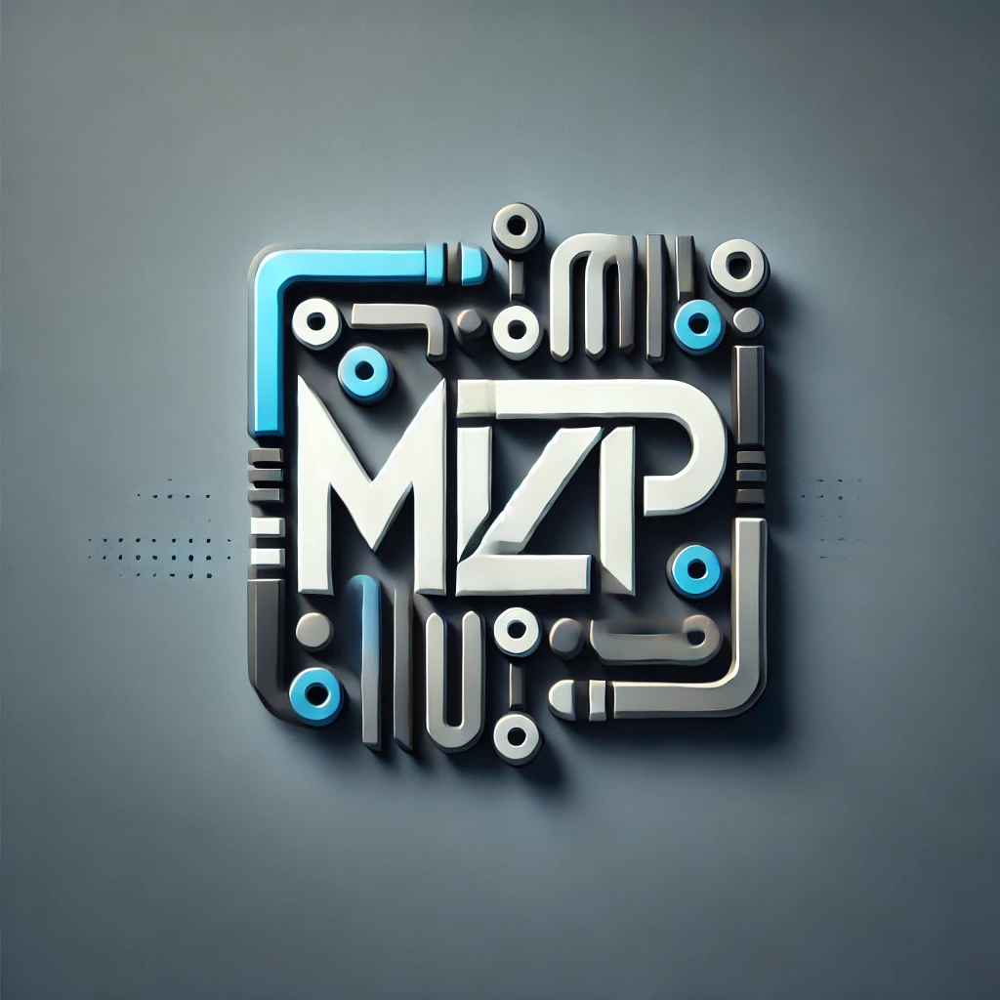
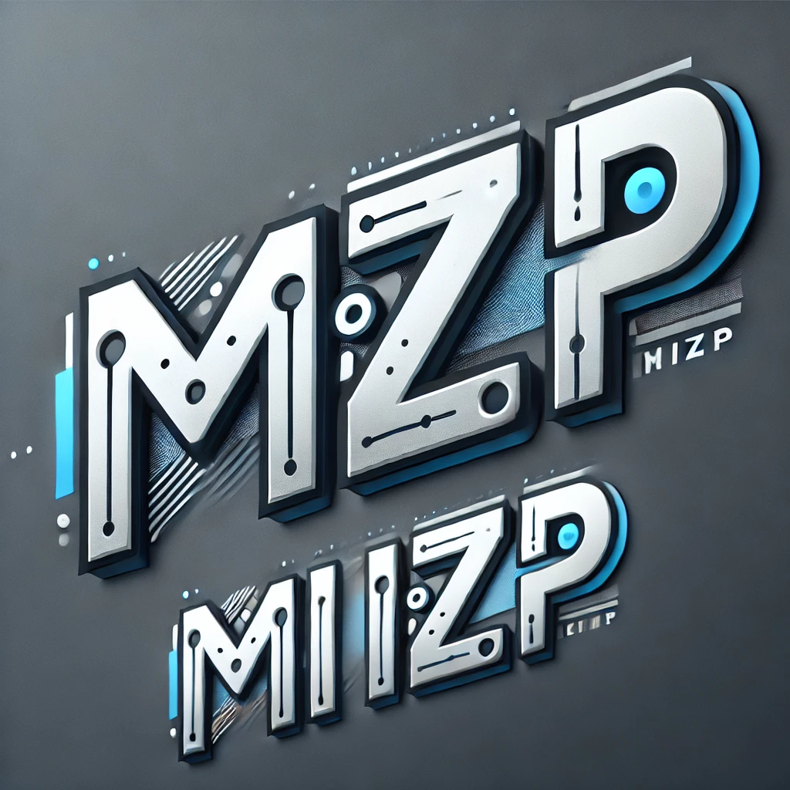
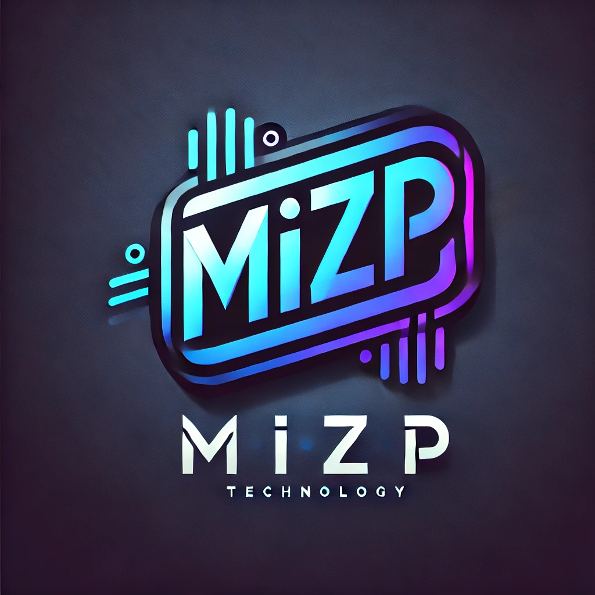
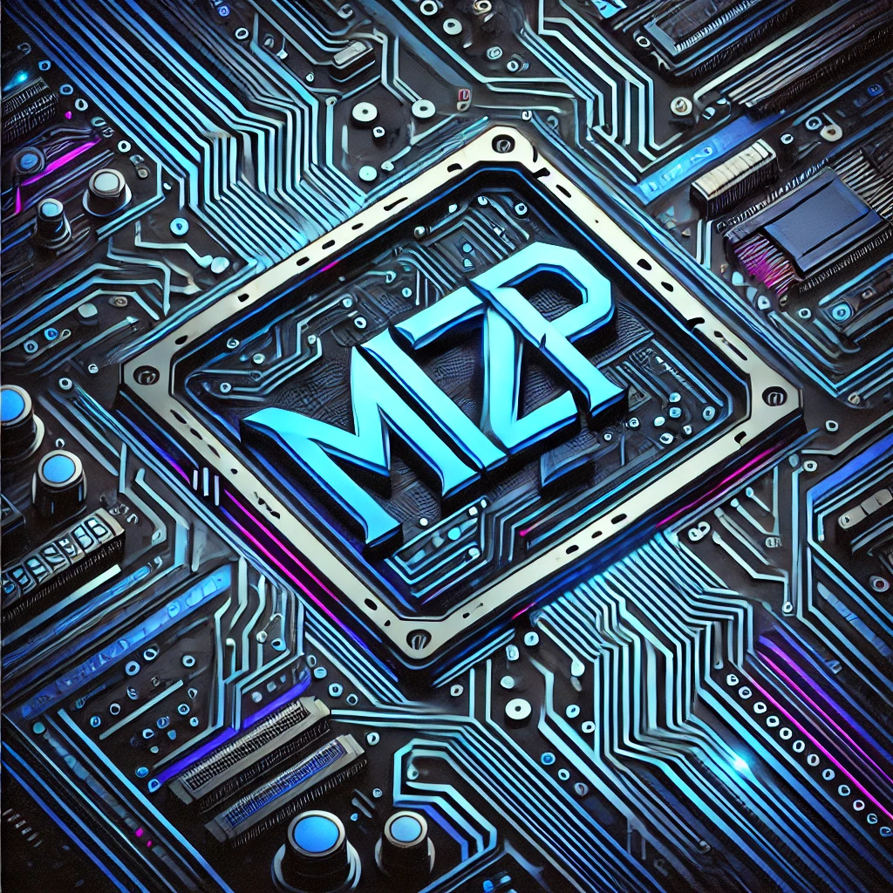
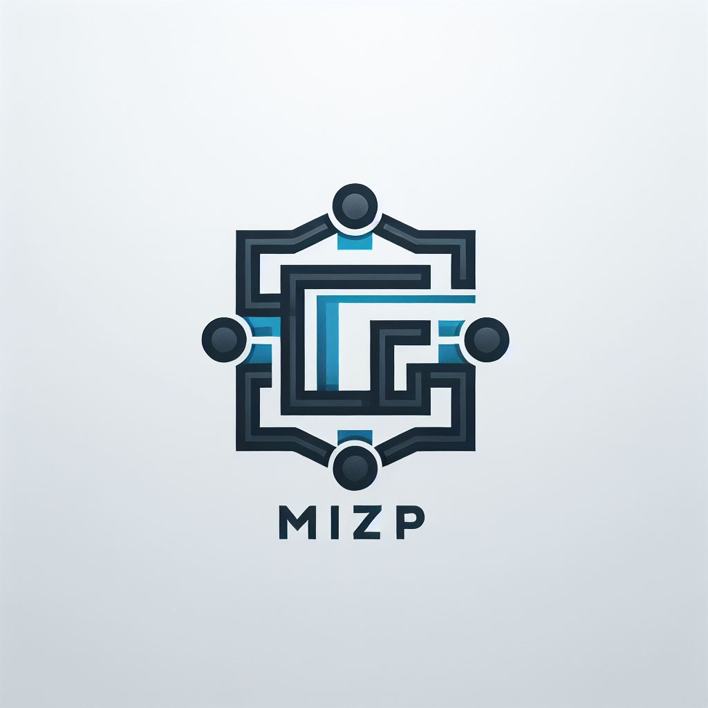

# Natural ou Fake Natty? Como Vencer na Era das IAs Generativas

## 🚀 Introdução

> Woooow! Look at this 👀

Olá pessoal, Venilton da DIO aqui! Inspirado na hype _"Natty or Not"_ do fisiculturismo, este Lab da DIO te convida a conhecer o mundo das IAs Generativas, explorando o potencial dessas tendências tecnológicas incríveis!

## 🎯 Bora Pro Desafio!? Você Já Venceu 💪🤓

### Objetivos

1. **Explorar IAs Generativas**: Utilize essas tecnologias para criar conteúdos que sejam o mais realista possível. Seja criativo! Você pode produzir imagens, textos, áudios, vídeos ou combinações de tudo isso!
1. **Potfólio de Projetos**:
   1. Faça o "fork" deste repositório, criando uma cópia em seu GitHub pessoal;
   2. Edite seu README com os detalhes do seu projeto, siga nosso [Template](#template) (é só copiar, colar e preencher);
   3. Submeta o link do seu repositório na plataforma da DIO. Pronto, você acabou de fortalecer seu portfólio de projetos nos perfis do GitHub e DIO 🚀
1. **Efeito de Rede**: Compartilhe seus resultados nas redes sociais com a hashtag **#LabDIONattyOrNot**. Não esqueça de nos marcar: [DIO](https://www.linkedin.com/school/dio-makethechange) e [falvojr](https://www.linkedin.com/in/falvojr).

### Template

# Criação de uma logomarca ;)

## 📒 Descrição

Utilizar uma ferramenta de IA para gerar uma logomarca

## 🤖 Tecnologias Utilizadas

Para esse rojeto foi utilizado a IA do chatGPT e IA Microsoft copilot

## 🧐 Processo de Criação

Solicitei a inteligencia artifical que criasse uma logomarca, utilizando o prompt abaixo:
-"Crie uma logomarca para uma empresa de tecnologia, onde deve contem as letras 'MizP'. As letras não podem se repetir."

Depois ui alterando as solicitações para alterar as logomarcas, como descrito abaixo:

- "Utilize cores vibrantes"
- "Utilize um modelo abstrato"
- "Utilize cores neutras"

## Resultados

### Logomarcas criada com chatGPT

### Logomarcas criada com copilot

## 💭 Reflexão (Opcional)

A criação de 'natty' é um pouco complicado na forma que você cria o seu prompt para que a IA possa executar o que você deseja.
Outra coisa é você verificar o que cada IA entende, mesmo você passando as mesmas informações para 2 IA's diferentes, que foi o meu caso.
Mas, mesmo assim é impressionando ver o que as IA's são capazes de criar.
